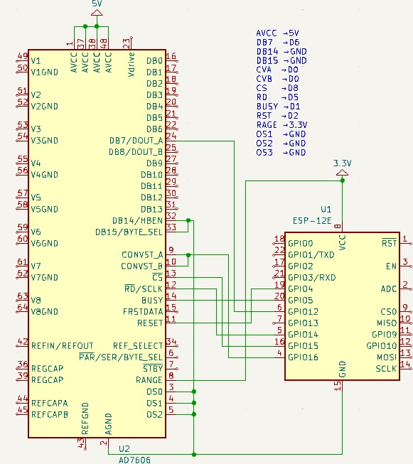

# AD7606 ADC Sensor Library for ESP8266 (ESP12E)

[English](./README.md) | 繁體中文

此函式庫提供使用 ESP8266 (例如 NodeMCU) 與 AD7606 ADC 溝通、讀取電壓值的功能。

## 功能特色

- 透過硬體 SPI 讀取 AD7606 的 8 通道資料
- 自訂 SPI 速度、位元順序、運作模式
- 內建簡易的誤差校正參數供調整 (scaleFactor & errorConst)
- 可直接印出 8 通道電壓資訊

## 安裝

1. 下載或 clone 此專案，放到 Arduino 的 `libraries` 資料夾底下。
2. 確認資料夾名稱為 `AD7606-ADC-Sensor-Library-for-ESP8266`。
3. 重新開啟 Arduino IDE，或點選「匯入函式庫」，即可在範例中找到 `BasicRead`。

## 使用方法

1. 在程式中 `#include <AD7606_ESP8266.h>`。
2. 建立 `AD7606_ESP8266` 物件。
3. 依照你的接線設定 `setPins()`，也可自訂 SPI 設定 `setSPISettings()`。
4. 呼叫 `begin()` 初始化後即可開始讀取。
5. 使用 `readData()` 與 `parseRawBytes()` 取得資料，再透過 `getVoltage()` 取得實際電壓。

範例程式請參考 `examples/BasicRead/BasicRead.ino`。

## ESP8266 連接方法

## License

本專案使用 MIT [LICENSE](./LICENSE) 授權
